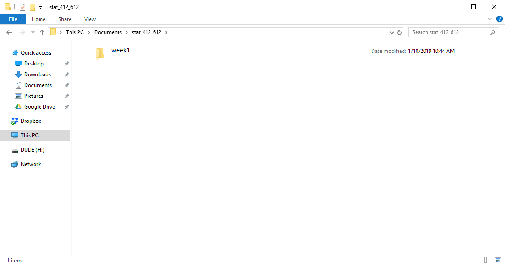
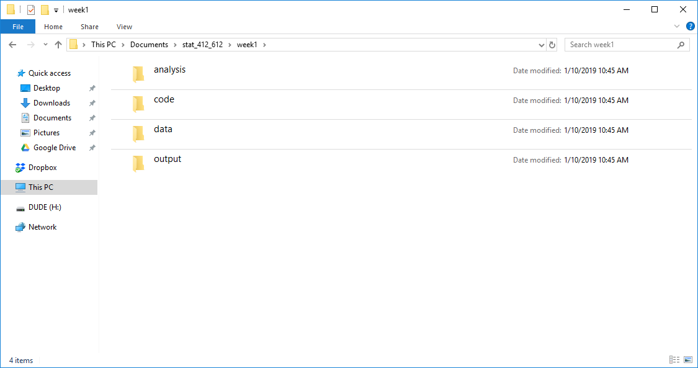

```{r setup, include=FALSE}
knitr::opts_chunk$set(echo = FALSE)
```

## Learning Objectives

- Practical file organization for data science projects.

## Bad:

- You place everything on the Desktop.

- Hard to find files.

- Hard to find datasets.

- Projects are mixed up with each other.

## Folder guidelines

- Create a new folder for collections of projects that share a theme
  (such as a course).

- Within this master folder, create a new folder for each project 
  (such as an assignment, an exam, an in-class worksheet, or a week of class).
  
- Within each project, create separate folders for data, analysis files, code,
  and output.

## Folder naming guidelines

- Same guidelines as variable naming use either the camelCaseSystem or the
snake_case_system. 

- Avoid spaces because they make accessing those
folders slightly more annoying when you are coding.

    - Bad: "rna seqAnalysis"
    - Good: "rna_seq_analysis"
    - Good: "rnaSeqAnalysis"

- Use names that are informative but concise. 

    - Bad: "folder_1"
    - Good: "rna_seq_analysis"

## Class Folder

- Create the folder "stat_412_612" somewhere in your computer 
  (such as "Documents").

\ 

## Project Folder

- Create the folder "week1" within "stat_412_612".

\ 

## Within Project Folder

- Create the "analysis", "data", "output", and "code" folders.

\ 


## In "analysis"

- This folder contains all Rmarkdown files.

- Rmarkdown (".Rmd") files contain a mix of code and plain text.

- These allow you to present a data analysis (in code) with the context 
  (in words) in one file.
  
## In "code"

- This contains R scripts (".R") that are used in multiple Rmarkdown files.

- It allows you to reuse code across multiple files.

## In "data"

- Place *raw* and *unmodified* data files.

- Once you place a dataset in "data", never touch it again.

## In "output"

- This will contain figures, modified datasets, and files containing
  summary statistics.
  
  
## Some Considerations

- You won't use every folder in every project. E.g. you might not have any code
  that needs to be shared between Rmarkdown folders.

- If your project gets really large, you can create folders within the analysis,
  code, data, and output folders. But for this class this should be sufficient.
  

