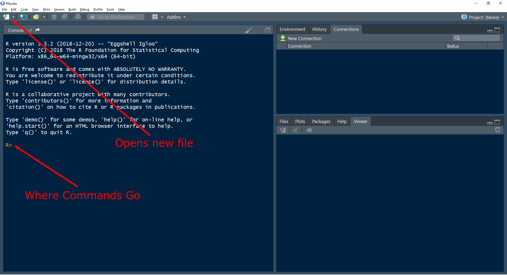
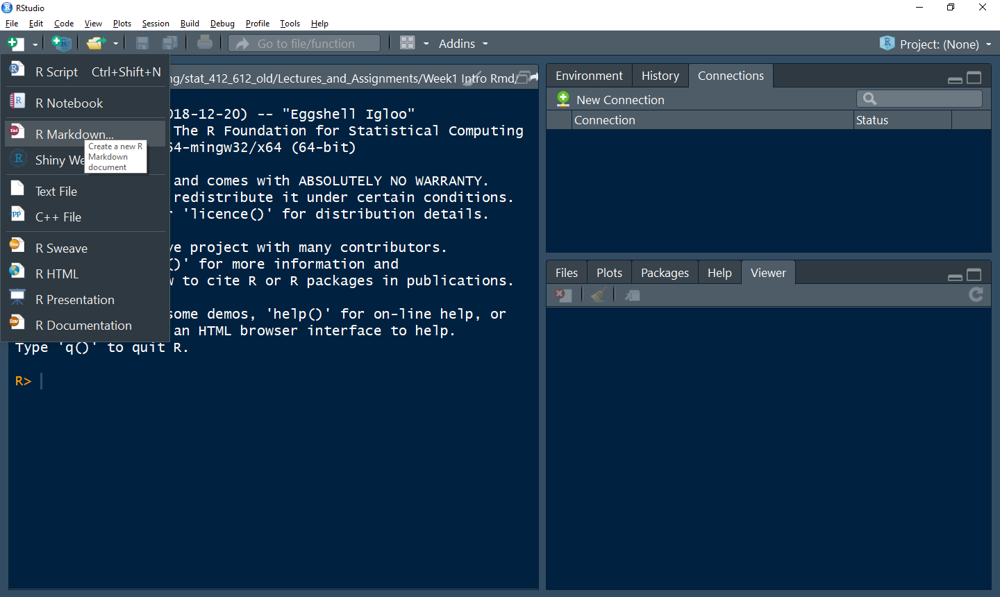
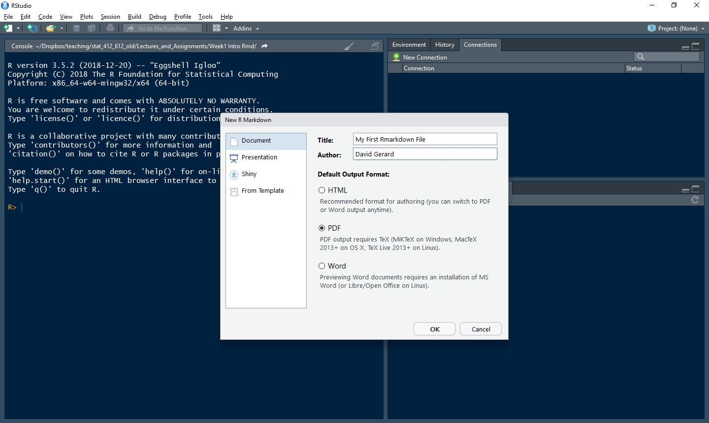

```{r setup, include=FALSE}
knitr::opts_chunk$set(echo = TRUE)
inline <- function(x = "") paste0("`` `r ", x, "` ``")
```

## Learning Objectives

- Install R
- Understand the basics of R
- R Markdown
- Chapters 1, 2, 4, and 27 of [RDS](https://r4ds.had.co.nz/)
- [RStudio IDE Cheat Sheet](https://www.rstudio.com/resources/cheatsheets/#ide)
- [R Markdown Cheat Sheet](https://www.rstudio.com/resources/cheatsheets/#rmarkdown)

## Installations

- Install R from the Comprehensive R Network (CRAN): https://cran.r-project.org/

    - You will have to choose the appropriate operating system.
      If you are using Ubuntu, there are special instructions if you want the 
      newest version of R (v3.5.2 as of writing this document) as the default
      is to install an older version. This is not
      too important for this class, but some packages (mainly the ones in 
      [Bioconductor](https://www.bioconductor.org/)) require the newest 
      version of R. If you want to use these
      packages, you should follow these instructions: 
      https://cran.r-project.org/bin/linux/ubuntu/README.html

- Install RStudio: https://www.rstudio.com/

    - RStudio is **different** from R. R is a statistical programming language. 
      RStudio is an Integrated Development Environment (IDE), a software 
      application used to write R code. It contains tools (such as shortcut
      buttons and syntax autocmpletion and highlighting) that make coding in R
      much easier. Most data scientists either use 
      [RStudio](https://www.rstudio.com/), 
      [Jupyter Notebook](https://jupyter.org/), or 
      [Emacs Speaks Statistics](https://ess.r-project.org/) to interact with R.
      
## Getting Started

- When you first open up RStudio, it should look something like this:

    \ 

- The area right next to the carrot ">" is called a **prompt**. You insert
  commands into the prompt.
  
- You can use R as a powerful calculator. Try typing some of the following
  commands into the command prompt:
  
    ```{r, eval = FALSE}
    3 * 7
    9 / 3
    4 + 6
    3 - 9
    (3 + 5) * 6
    3 ^ 2
    4 ^ 2
    ```

- What do you think `%%` does? Try it out on a few examples:

    ```{r, eval=FALSE}
    1 %% 2
    2 %% 2
    3 %% 2
    4 %% 2
    1 %% 3
    2 %% 3
    3 %% 3
    4 %% 3
    ```

- In general if you don't know what something does, there are three things you can do:

    1. Google it. Always add "in R" at the end of your search term. E.g. "%% in R".
    2. Use the `help()` function to see if there is a help page on it. E.g., 
       type `help("%%")` in the command prompt. This is the most important
       function in R.
    3. Play around with it, changing the inputs until you figure out what it does.
    
## RStudio Options

- RStudio will automatically save a bunch of leftover stuff when you exit it.
  This is bad for reproducibility because you might be depending on code that
  you ran in a previous session (which you no longer can view). We'll get rid
  of these silly options. 
  
- Open up "Tools > Global Options... > General" and
    
    - **Uncheck** "Restore .RData into workspace at startup".
    - Change "Save workspace to .RData on exit" to "Never".

## R Basics

### Variables

- R consists of two things: **variables** and **functions** (computer 
  scientists would probably disagree with this categorization).

- A **variable** stores a value. This value can be:

    1. A **numeric** (a number): `1`, `2`, `3`, `4`
    2. A **string** (a word/character). These are always surrounded by 
       quotation marks: `"Hello"`, `"world"`, `"32"`.
    3. A **logical** (either `TRUE` or `FALSE`).
    4. A **factor** (categorical variable), more on this later.
    5. A **vector** of numerics/strings/logicals/factors. A vector is a 
       sequence of something of the same type. E.g.
        ```{r, echo = FALSE, eval = TRUE}
        c(1, 2, 3, 4)
        c("Hello", "world", "32")
        ```
    6. A **matrix** of numerics/strings/logicals/factors. A matrix is a 
       rectangle of elements of the same type. E.g.
        ```{r, echo = FALSE, eval = TRUE}
        matrix(c(1,2,3,4,5,6), nrow = 2)
        matrix(c("this","is","a","matrix","of","strings"), nrow = 2)
        ```
    7. A **list** of any sequence of objects.
        ```{r, echo = FALSE, eval = TRUE}
        list("hello", 3, TRUE)
        ```
    8. A **data frame** where each column is a vector of a certain type
       (a vector of numerics or strings or logicals or factors).
       
- You **assign** variables values with `<-` (you can also use `=`, but only 
  noobs do that). For example, assign `x` the value of `7`.
    ```{r, eval = FALSE}
    x <- 7
    ```

- If you type `x` now into the command promt, it will return what is stored in
  `x`:
    ```{r, eval = FALSE}
    x
    ```

- Creating variables is useful because it allows you to reuse those values
  over and over again.
  
- You can apply arithmetic operations to variables as you would to numbers.
    ```{r, eval = FALSE}
    y <- 9
    x + y
    x * y
    x / y
    x - y
    ```

- You assign strings and logicals via:

    ```{r}
    z <- "I AM A STRING"
    x <- TRUE
    ```

- Notice that we overwrote `x` to now be `TRUE` instead of 7. This is possible 
  in R (in other languages the type is pre-defined and not changed easily).
  
- I've chosen horrible variable names so far. Generally variable names should 
  be:

      - Nouns
      - Informative about what it is storing, yet concise.
      - Use either the `camelCaseSystem` or the `snake_case_system`.
      - You are also able to use periods in variable names, but only noobs do
        that (it makes things more confusing in more advanced R).

- Variables are **case sensitive**, so `Variable` is different from `variable`.
  Try this out:

    ```{r, eval = FALSE}
    variable <- 1
    Variable <- 2
    variable
    Variable
    ```

- When I write a variable inline, it will look like `this`.

- Exercise: Why doesn't this code work?

    ```{r, eval=FALSE}
    my_variable <- 10
    my_variab1e
    ```

    ```{r, eval = FALSE}
    data0 <- 1
    dataO
    ```

  
### Functions

- Functions take objects (such as numbers or variables) as input and output
  new objects. Let's look at a 
  simple function that takes the log of a number:
  
    ```{r, eval=FALSE}
    log(x = 4, base = 2)
    ```
  
- The inputs are called "arguments". Generally, every function will be for the
  form:
  
    ```{r, eval = FALSE}
    function_name(arg1 = val1, arg2 = val2, ...)
    ```

- If you do not specify the name of the argument, R will assume you are 
  assigning in their order.
  
    ```{r, eval = FALSE}
    log(4, 2)
    ```

- You can change the order of the arguments if you specify them.

    ```{r, eval = FALSE}
    log(base = 2, x = 4)
    ```

- To see the list of all possible arguments of a function, use the `help()` 
  function:
  
    ```{r, eval=FALSE}
    help(log)
    ```

- In the help file, there are often **default** values for an argument. For 
  example, the following indicates the the default value of `base` is `exp(1)`.
  
    ```{r, eval = FALSE}
    log(x, base = exp(1))
    ```
  
- This indicates that you can omit the `base` argument and R will assume that 
  it should be `exp(1)`.
  
    ```{r}
    log(x = 4, base = exp(1))
    log(x = 4)
    ```

- If an argument does not have a default, then it must be specified when calling
  a function.
  
- Type this:

    ```{r, eval = FALSE}
    log(x = 4,
    ```

- The "+" indicates that R is expecting more input (you forgot either a
  parentheses or a quotation mark). You can get back to the prompt by hitting
  the ESCAPE key.
  
  
- There are a *lot* of functions that come pre-installed with R. Don't try to 
  memorize the list of all of them functions. The best course of action is to
  Google the functionality you need and you'll automatically pick up the names
  as you go.
  
- But here is a reference card with some basic functions: https://cran.r-project.org/doc/contrib/Short-refcard.pdf
  
- A **package** is a collection of functions that don't come with R by default.

- There are **many many** packages available. If you need to do any data
  analysis, there is probably an R package for it.

- Using `install.packages()`, you can install packages that contain functions 
  and datasets that are not available by default. Do this now with the 
  tidyverse package:
  
    ```{r, eval = FALSE}
    install.packages("tidyverse")
    ```

- You will only need to install a package once per computer. Once it is 
  installed you can gain access to all of the functions and datasets in a
  package by using the `library()` function. 
  
    ```{r, eval=FALSE}
    library(tidyverse)
    ```

- You will need to run `library()` at the start of every R session if you 
  want to use the functions in a package.
  
- When I want to write the name of a function, I will write it like `this()`.

- Generally function names should be:

      - Verbs
      - Informative about what it is does, yet concise.
      - `useTheCamelCaseSystem()` or `use_the_snake_case_system()`.
      - You are also able to use periods in function names, but only noobs do
        that (it makes things more confusing in more advanced R).
      - But lots of base R functions have periods in them: `is.na()`, 
        `which.max()`, `data.frame()`, etc.
        
### Vectors and Indexing

- In statistics we deal with data. To manage and analyze data in R, we need a 
  way to store those data.
  
- The most basic and useful way to store data is in a vector.
- A vector is a sequence of data elements.

- It's tempting to use the word "list" to describe it, however a List is 
  actually a very specific thing   in R. 
  
-  Vectors are great because we can perform opertations on every single value 
  in a vector without iterating through it.
  
- For those of you who have used Python before, you might be used to writing 
  for-loops to work on values in a list. That's not necessary here.
  
- Vectors are created in R using the `c()` function.

- "c" stands for concatonate, which means stick together.

- Create a of numbers now:

    ```{r, eval=FALSE}
    my_first_vector <- c(3, 6, 2, 5)
    ```

- **Exercise**: What does `my_first_vector + 4` do?

- **Exercise**: What does `my_first_vector * 4` do?

- You can refer to individual elements of a vector using brackets `[]`

    ```{r, eval = FALSE}
    my_first_vector[1]
    my_first_vector[2]
    my_first_vector[3]
    my_first_vector[4]
    ```

- You can refer to multiple elements in a vector by creating an indexing vector
  first.
  
    ```{r, eval = FALSE}
    indexing_vector <- c(2, 4)
    my_first_vector[indexing_vector]
    ```

- You can skip the intermediate step by placing `c(2, 4)` directly in the 
  brackets.
  
    ```{r, eval = FALSE}
    my_first_vector[c(2, 4)]
    ```

- You can create a vector in a sequence using the `seq()` function. 

- **Exercise**: Read up on the `seq()` function to create a vector of even 
  numbers from 52 to 1000. Then extract the 3rd and 29th elements from this
  vector.
  
    ```{r, eval = FALSE, echo = FALSE}
    newvec <- seq(52, 1000, by = 2)
    newvec[c(3, 29)]
    ```

- You can extract elements of a vector by using logicals. What does the 
  following code do?
  
    ```{r, eval = FALSE}
    logvec <- c(TRUE, FALSE, FALSE, TRUE)
    my_first_vector[logvec]
    ```
  

## R Markdown

- R Markdown is a file format that is a combination of plain text and R code.

- A free book on R Markdown is available here: https://bookdown.org/yihui/rmarkdown/

- You write code and commentary of code in one file. You may then compile 
  (RStudio calls this "Knitting") the R Markdown file to many different kinds
  of output: pdf (including beamer presentations), html (including various
  presentation formats), Word, PowerPoint, etc.

- R Markdown is useful for:

    1. Communication of statistical results.
    2. Collaborating with other data scientists.
    3. Using it as a modern lab notebook to *do* data science.
    
- *You will use R Markdown for all assignments in this class.*

- Open up a new R Markdown file:

\ 

- Choose the options for the type of output you want

\ 


- You should now have a rudimentary R Markdown file.

- Save a copy of this file in your "analysis" folder in the "week1" project.

- R Markdown contains three things

    1. A YAML (Yet Another Markup Language) header that controls options for
       the R Markdown document. These are surrounded by `---`.
    2. Code **chunks** --- bits of R code that that are 
       surrounded by ` ```{r} ` and ` ``` `. Only valid R code should go in 
       here.
    3. Plain text that contains simple formatting options.
    
- All of these are are displayed in the default R Markdown file. You can compile
  this file by clicking the "Knit" button at the top of the screen or by 
  typing CONTROL + SHIFT + K. Do this now.
    
### Formatting markdown

- Here is Hadley's brief intro to formatting text in R Markdown:

    ```{r, comment="", echo=FALSE}
    cat(readr::read_file("./formatting.md"))
    ```

### Code Chunks

- You can insert new code-chunks using CONTROL + ALT + I (or using the 
  "Insert" button at the top of RStudio).

- You write all R code in chunks. You can send the current line of R code (the
  line where the cursor is) using CONTROL + ENTER (or the "Run" button at the 
  top of RStudio).
  
- You can run all of the code in a chunk using CONTROL + ALT + C (or using 
  the "Run" button at the top of RStudio).
  
- You can run all of the code in the next chunk using CONTROL + ALT + N (or
  using the "Run" button at the top of RStudio).


### YAML Header

- My typical YAML header will looks like this

    ```{r, comment="", echo=FALSE}
    cat(readr::read_file("./yaml_header.Rmd"))
    ```

- All of those settings are fairly self-explanatory.

- The full list of outputs supported is here: https://rmarkdown.rstudio.com/formats.html
    
- The `r inline("Sys.Date()")` will insert the current date.

### Inline R Code

- Sometimes, you want to write the output of some R code inline (rather than
as the output of some chunk). You can do this by placing code within 
`r inline("")`. 

- I used this in the previous section for automatically writing the date. 

```{r}
my_name <- "David"
```

- Then "my name is `r inline("my_name")`" will result in "my name is `r my_name`".

- For a more realistic example, you might calculate the $p$-value from a linear
  regression, then write this $p$-value in the paragraph of a report.


  
