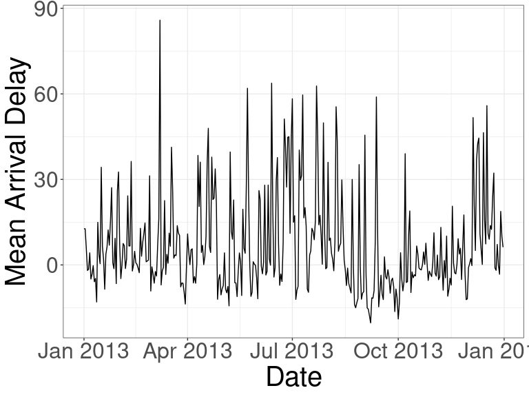

## Learning Objectives

- Make beautiful presentations in R.
- Section 29.5 of [RDS](https://r4ds.had.co.nz/).

## Background

- You can make a presentation using R Markdown.

- New slides are made with two hash tags `##` (instead of creating a header).

- Sections of a presentation are made with one hash tag `#`.

- Otherwise, just use the same code from R Markdown as before.

## Create a New Presentation File

\ 

## Create a New Presentation File

\ 

## Types of Presentations

- The R Markdown `output` options of `ioslides_presentation` and `slidy_presentation` both create HTML presentations (with different styles).

- The R Markdown `output` option of `beamer_presentation` creates a PDF presentation.

- `powerpoint_presentation` outputs a powerpoint that you could then 
  edit by hand.

- You can also download the revealjs and rmdshower packages to use the 
  `revealjs::revealjs_presentation` and `rmdshower::shower_presentation`
  to get two other HTML styles.
  
## Beamer Themes

- For PDF presentations, you can change the theme using the `theme` and `colortheme` YAML arguments.

- For a list of themes, see <https://hartwork.org/beamer-theme-matrix/>. The 
  rows index the `theme` and the columns index the `colortheme`.

## Beamer Themes

- Here is an example YAML header for the `CambridgeUS` theme and the `seahorse` colortheme.
  
```
---
title: "Presenatations in R Markdown"
author: "David Gerard"
date: "2021-04-02"
output: 
  beamer_presentation: 
    theme: "CambridgeUS"
    colortheme: "seahorse"
urlcolor: "blue"
---
```

## Exercise

- Create your own presentation in R Markdown. The first slide contains code that
  calculates the mean arrival delay for each day in the year 2013 from the 
  nycflights13 dataset. 

- The second slide contains the plot (without R code) on the following slide.

- Make this presentation using different presentation styles available in 
  R Markdown.
  
    

    

## Exercise Plot

\ 
    

  
  
